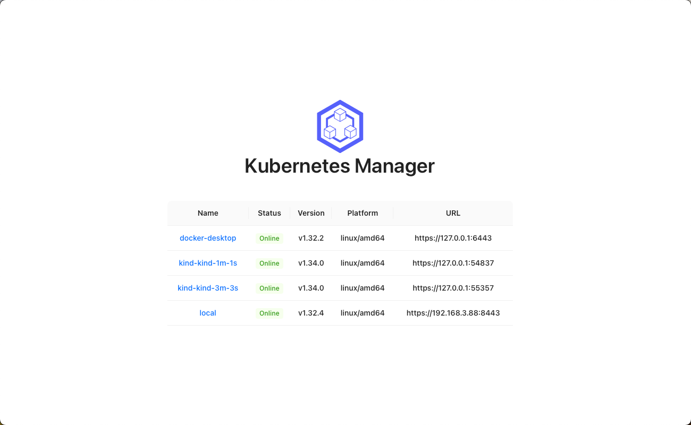
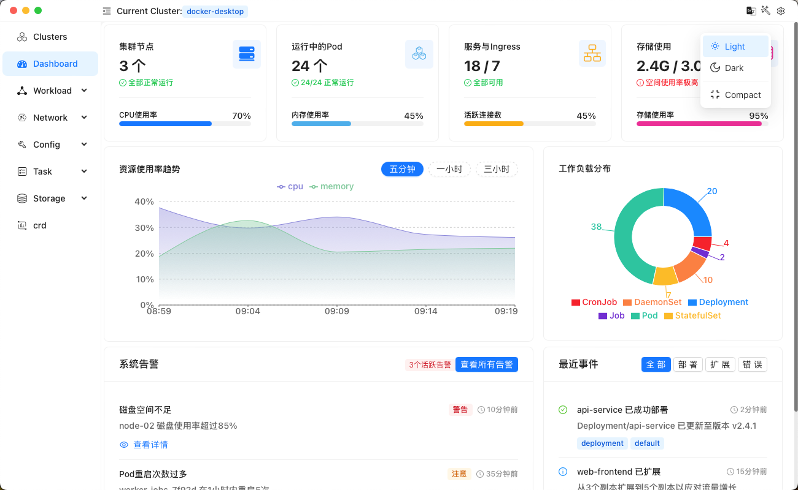
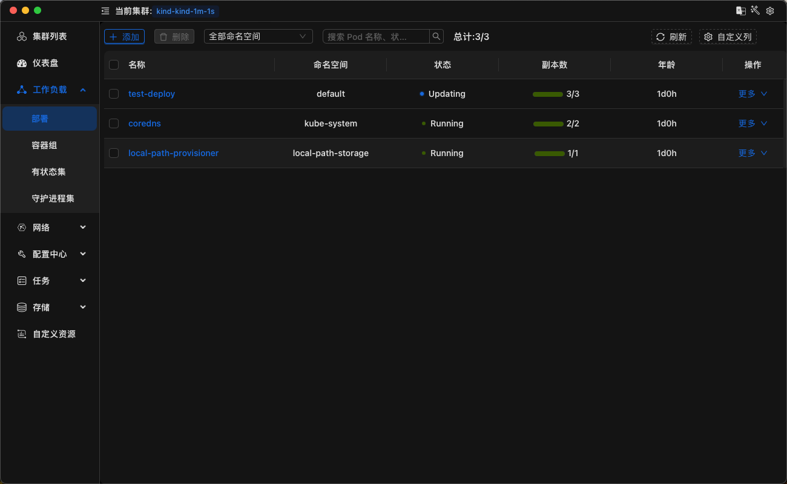
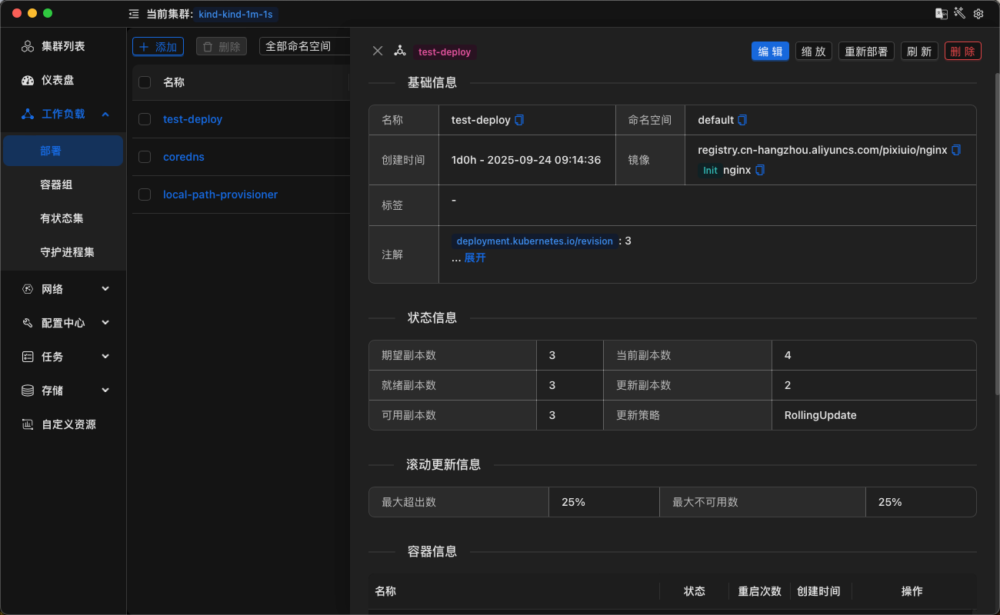
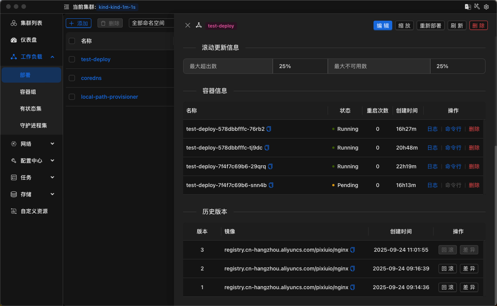
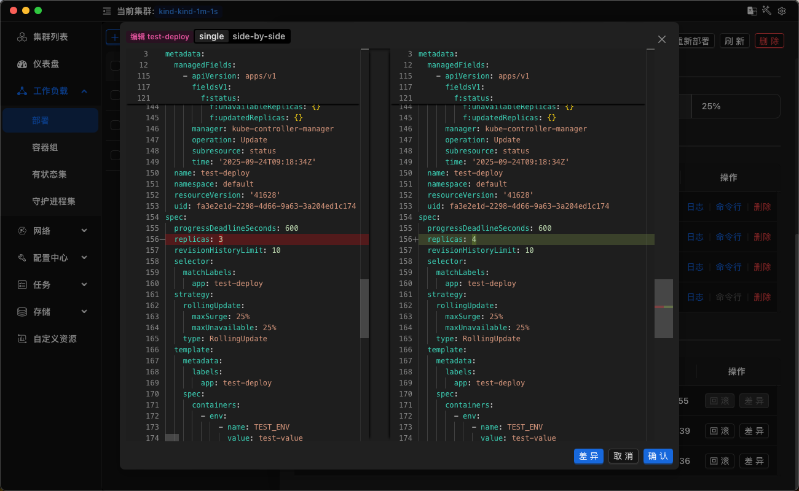
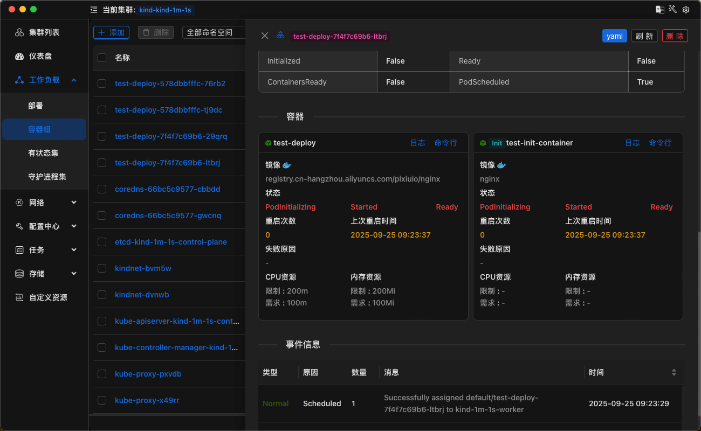
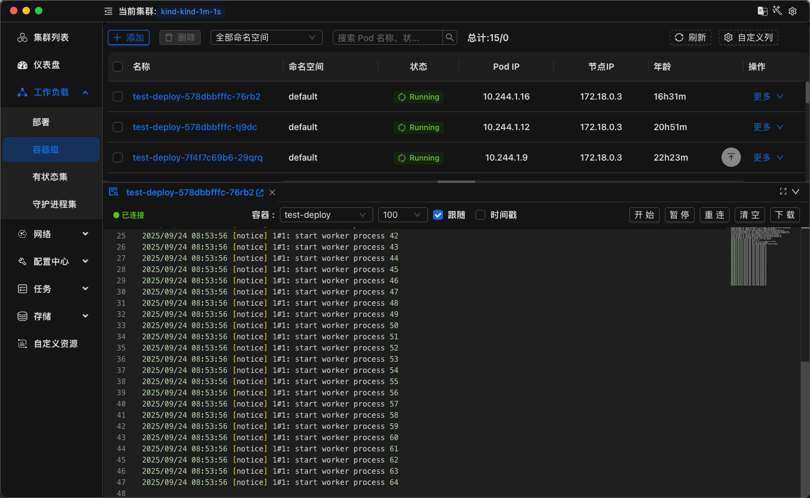
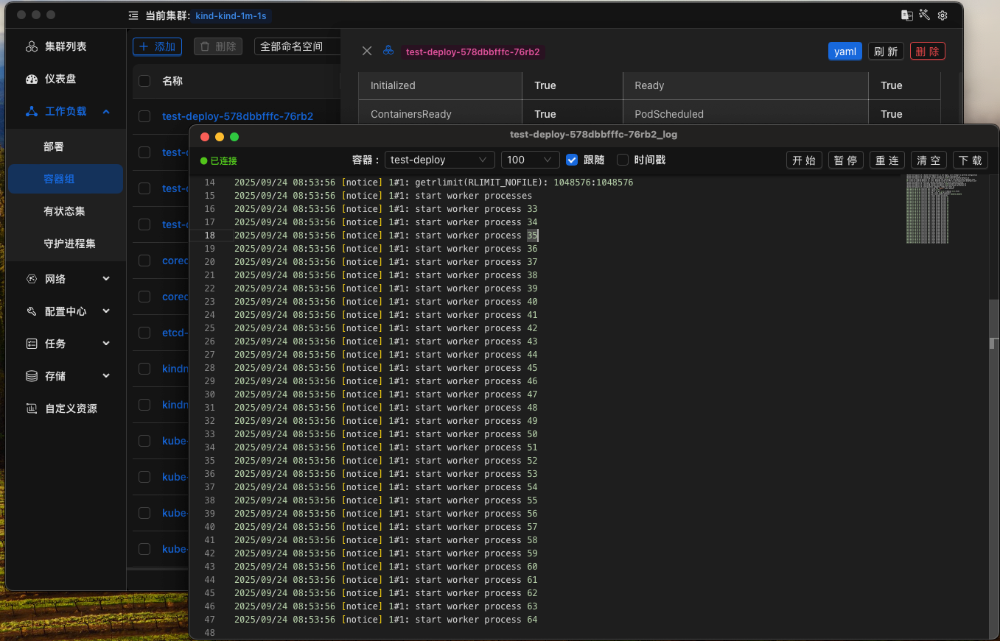
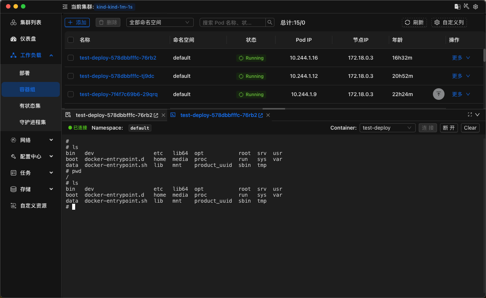

# KSM - Kubernetes Manager

### 技术栈

- rust + kube-rs + react + antd + tauri

### TODO

- [x] deployment页面
- [x] pod页面
- [x] 添加日志功能
- [x] SSH 功能
- [ ] 日志功能优化,实时刷新导致页面卡顿,CPU占用过高

# 页面预览

- [VS Code](https://code.visualstudio.com/) + [Tauri](https://marketplace.visualstudio.com/items?itemName=tauri-apps.tauri-vscode) + [rust-analyzer](https://marketplace.visualstudio.com/items?itemName=rust-lang.rust-analyzer)

