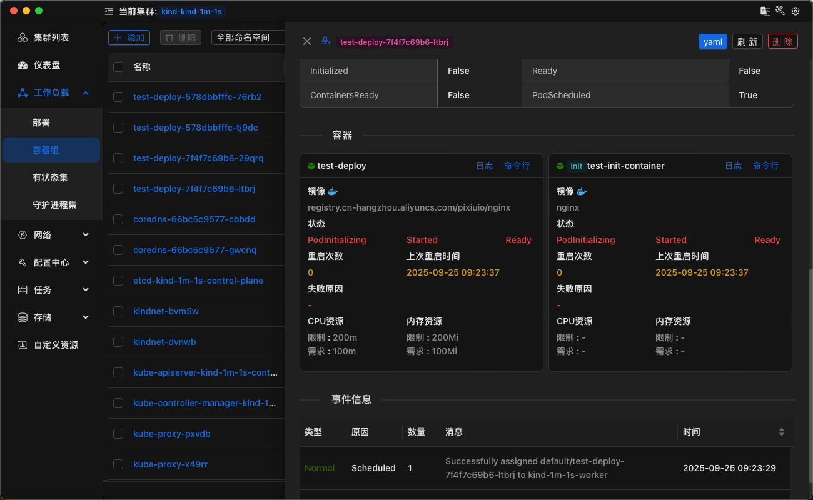

  

  <b> KSM - Kubernetes Manager </b>

# KSM 是什么?

KSM (kubernetes manager) 是一个基于 Kubernetes 的管理工具,为了方面管理集群的资源,KSM 集成了 kubernetes 的所有资源,并且提供了丰富的功能。

### 技术栈

- rust + kube-rs + react + antd + tauri

### TODO

- [x] deployment页面
- [x] pod页面
- [x] 添加日志功能
- [x] SSH 功能
- [x] 日志功能优化,实时刷新导致页面卡顿,CPU占用过高
- [ ] AI 功能

### 页面预览

